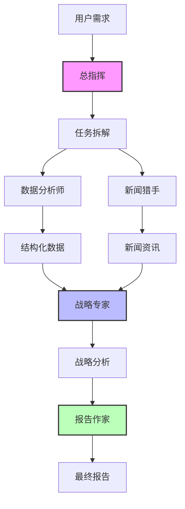

# agent
agent
# 多智能体深度研究报告生成系统

<div align="center">

[](https://www.python.org/)
[](https://openai.com/)
[](https://www.langchain.com/)
[](LICENSE)

**一个基于多智能体协作的自动化研究报告生成系统**

[特性](#特性) • [系统架构](#系统架构) • [快速开始](#快速开始) • [使用示例](#使用示例) • [扩展开发](#扩展开发)

</div>

---

## 📖 项目简介

本项目实现了一个**完整的多智能体协作系统**，模拟专业研究团队的工作流程。通过5个分工明确的AI智能体，系统能够自动完成从数据收集、新闻搜索、战略分析到报告撰写的全流程工作，生成高质量的深度研究报告。

### 核心价值

- 🚀 **自动化**：全流程自动化，无需人工干预
- 🎯 **专业性**：每个智能体专注于特定领域，模拟真实团队协作
- 📊 **数据驱动**：基于真实数据和新闻的分析，避免凭空臆测
- 🔄 **可扩展**：模块化设计，易于添加新的智能体或工具

---

## ✨ 特性

### 核心功能

- **智能任务拆解**：总指挥自动理解需求并分解任务
- **并行数据收集**：同时获取结构化数据和新闻资讯
- **多维度分析**：SWOT分析、竞争格局、战略建议
- **自动生成图表**：数据可视化，提升报告可读性
- **专业报告输出**：Markdown格式，结构完整

### 技术特性

- **模块化架构**：每个智能体独立运行，便于维护和扩展
- **异步协作**：支持智能体并行工作，提升效率
- **容错机制**：单个智能体失败不影响整体流程
- **可配置性**：支持自定义提示词、模型参数等

---

## 🏗️ 系统架构

### 智能体角色

| 智能体 | 职责 | 工具/能力 |
|--------|------|-----------|
| **总指挥 (Manager)** | 任务拆解、协调、整合 | LLM推理、任务规划 |
| **数据分析师 (Data Analyst)** | 数据收集、处理、统计 | API调用、Pandas分析 |
| **新闻猎手 (News Hunter)** | 新闻搜索、情感分析 | 网络搜索、NLP分析 |
| **战略专家 (Strategist)** | SWOT分析、战略建议 | 商业分析框架、LLM推理 |
| **报告作家 (Writer)** | 报告撰写、图表生成 | Markdown、Matplotlib |

### 工作流程



### 技术栈

- **核心框架**：Python 3.9+
- **AI模型**：OpenAI GPT-4 (支持GPT-3.5)
- **Agent编排**：LangChain / AutoGen (可扩展)
- **数据处理**：Pandas, NumPy
- **可视化**：Matplotlib
- **API集成**：RESTful API, SerpAPI

---

## 🚀 快速开始

### 环境要求

- Python 3.9 或更高版本
- OpenAI API Key ([获取地址](https://platform.openai.com/api-keys))
- 可选：SerpAPI Key (用于新闻搜索)

### 安装步骤

1. **克隆仓库**
```bash
git clone https://github.com/yourusername/multi-agent-research.git
cd multi-agent-research
```

2. **安装依赖**
```bash
pip install -r requirements.txt
```

3. **配置环境变量**
```bash
cp .env.example .env
# 编辑 .env 文件，填入你的 API Keys
```

`.env` 文件内容：
```env
OPENAI_API_KEY=sk-your-openai-api-key-here
SERPAPI_KEY=your-serpapi-key-here  # 可选
MODEL_NAME=gpt-4-turbo-preview
```

4. **运行系统**
```bash
python main.py
```

### Docker 部署（可选）

```dockerfile
# Dockerfile
FROM python:3.9-slim

WORKDIR /app

COPY requirements.txt .
RUN pip install --no-cache-dir -r requirements.txt

COPY . .

CMD ["python", "main.py"]
```

```bash
docker build -t multi-agent-research .
docker run -it --env-file .env multi-agent-research
```

---

## 📝 使用示例

### 基础用法

```python
from main import MultiAgentSystem

# 初始化系统
system = MultiAgentSystem()

# 运行研究
result = system.run("新能源汽车市场2025年竞争格局")

# 保存报告
system.save_report(result, "my_report.md")
```

### 输出示例

系统会生成一份包含以下内容的完整报告：

```markdown
# 新能源汽车市场2025年竞争格局研究报告

## 📊 执行摘要
基于对100+数据点和50+新闻来源的分析...

## 📈 数据概览
- 总销量：8,500,000 辆
- 年增长率：35.2%
- 市场集中度：CR3 = 65%

## 🔍 深度分析
### SWOT分析
| 维度 | 内容 |
|------|------|
| 优势 | 技术领先、政策支持 |
| 机会 | 海外市场扩张 |

## 💡 战略建议
1. 加大研发投入...
2. 布局海外供应链...
```

### 自定义查询

```python
# 不同领域的查询示例
queries = [
    "人工智能芯片市场2025年发展趋势",
    "光伏产业政策分析与投资机会",
    "新能源汽车充电桩基础设施建设评估"
]

for query in queries:
    result = system.run(query)
    system.save_report(result, f"report_{query[:10]}.md")
```

---

## 🔧 配置说明

### 模型配置

在 `config.py` 中调整：

```python
class Config:
    # 模型选择
    MODEL_NAME = "gpt-4-turbo-preview"  # 或 "gpt-3.5-turbo"
    
    # 温度参数（0-1，越低越确定）
    TEMPERATURE = 0.7
    
    # 最大迭代次数
    MAX_ITERATIONS = 3
    
    # 超时时间（秒）
    TIMEOUT_SECONDS = 30
```

### 智能体配置

每个智能体的系统提示词可在对应类中修改：

```python
class DataAnalystAgent(BaseAgent):
    def __init__(self):
        system_prompt = """自定义提示词..."""
```

### 数据源配置

在 `tools/data_fetcher.py` 中集成真实API：

```python
def fetch_real_data():
    # 替换为实际API调用
    response = requests.get("https://api.example.com/data")
    return response.json()
```

---

## 📂 项目结构

```
multi_agent_research/
│
├── agents/                    # 智能体模块
│   ├── base_agent.py         # 基类
│   ├── manager.py            # 总指挥
│   ├── data_analyst.py       # 数据分析师
│   ├── news_hunter.py        # 新闻猎手
│   ├── strategist.py         # 战略专家
│   └── writer.py             # 报告作家
│
├── tools/                     # 工具函数
│   ├── data_fetcher.py       # 数据获取
│   ├── web_search.py         # 网络搜索
│   └── chart_generator.py    # 图表生成
│
├── utils/                     # 工具类
│   └── message_bus.py        # 消息通信
│
├── outputs/                   # 输出目录
│   ├── final_report.md       # 生成的报告
│   └── report_chart.png      # 生成的图表
│
├── config.py                  # 配置文件
├── main.py                    # 主程序
├── requirements.txt           # 依赖列表
└── README.md                  # 说明文档
```

---

## 🎯 扩展开发

### 添加新的智能体

1. **继承基类**
```python
from agents.base_agent import BaseAgent

class RiskAnalystAgent(BaseAgent):
    """风险分析师"""
    
    def __init__(self):
        system_prompt = "你是风险分析专家..."
        super().__init__("RiskAnalyst", "Risk Manager", system_prompt)
    
    def execute(self, input_data):
        # 实现具体逻辑
        return {"risk_score": 0.8, "risks": [...]}
```

2. **集成到主流程**
```python
# 在 main.py 中
self.risk_analyst = RiskAnalystAgent()

# 在工作流中添加
risk_result = self.risk_analyst.execute({"data": data_result})
```

### 集成真实数据源

```python
# 使用 Yahoo Finance
import yfinance as yf

def fetch_stock_data(symbol: str):
    stock = yf.Ticker(symbol)
    hist = stock.history(period="1y")
    return hist.to_dict()

# 使用新闻API
def fetch_news_via_api(query: str):
    url = f"https://newsapi.org/v2/everything?q={query}"
    response = requests.get(url, headers={"X-Api-Key": API_KEY})
    return response.json()
```

### 添加数据库支持

```python
import sqlite3
from datetime import datetime

class ReportDatabase:
    def save_report(self, query, report):
        conn = sqlite3.connect('reports.db')
        c = conn.cursor()
        c.execute('''
            INSERT INTO reports (query, content, created_at)
            VALUES (?, ?, ?)
        ''', (query, report, datetime.now()))
        conn.commit()
        conn.close()
```

### Web界面集成

```python
# 使用 FastAPI
from fastapi import FastAPI, HTTPException
from pydantic import BaseModel

app = FastAPI()
system = MultiAgentSystem()

class ResearchRequest(BaseModel):
    query: str

@app.post("/research")
async def create_research(request: ResearchRequest):
    result = system.run(request.query)
    return {"report": result.get("final_report")}
```

---

## 📊 性能优化

### 并行执行
```python
import asyncio
from concurrent.futures import ThreadPoolExecutor

async def parallel_tasks():
    with ThreadPoolExecutor(max_workers=3) as executor:
        futures = [
            executor.submit(data_analyst.execute, query),
            executor.submit(news_hunter.execute, query)
        ]
        results = [f.result() for f in futures]
```

### 缓存机制
```python
from functools import lru_cache

@lru_cache(maxsize=100)
def cached_data_fetch(query: str):
    return fetch_data(query)
```

### 流式输出
```python
def stream_report_generation(query):
    yield "## 正在收集数据...\n"
    data = data_analyst.execute(query)
    yield f"### 数据概览\n{data}\n"
```

---

## 🐛 故障排除

### 常见问题

**Q: API调用失败**
```
错误：OpenAI API key无效
解决：检查.env文件中的OPENAI_API_KEY是否正确
```

**Q: 图表生成失败**
```
错误：Matplotlib后端错误
解决：添加以下代码
import matplotlib
matplotlib.use('Agg')
```

**Q: 智能体陷入循环**
```
现象：Agent反复请求同一数据
解决：在Manager中设置MAX_ITERATIONS限制
```

---

## 🤝 贡献指南

欢迎贡献代码、报告问题或提出建议！

1. Fork 本仓库
2. 创建特性分支 (`git checkout -b feature/AmazingFeature`)
3. 提交更改 (`git commit -m 'Add some AmazingFeature'`)
4. 推送到分支 (`git push origin feature/AmazingFeature`)
5. 开启 Pull Request

---

## 📄 许可证

本项目采用 MIT 许可证 - 详见 [LICENSE](LICENSE) 文件

---

## 🙏 致谢

- [OpenAI](https://openai.com/) - 提供强大的GPT模型
- [LangChain](https://www.langchain.com/) - Agent编排框架
- [AutoGen](https://microsoft.github.io/autogen/) - 多智能体框架灵感

---

## 📞 联系方式

- 项目维护者：Your Name
- Email：your.email@example.com
- 项目链接：[https://github.com/yourusername/multi-agent-research](https://github.com/yourusername/multi-agent-research)

---

<div align="center">

**如果这个项目对你有帮助，请给个 ⭐️ Star！**

</div>
